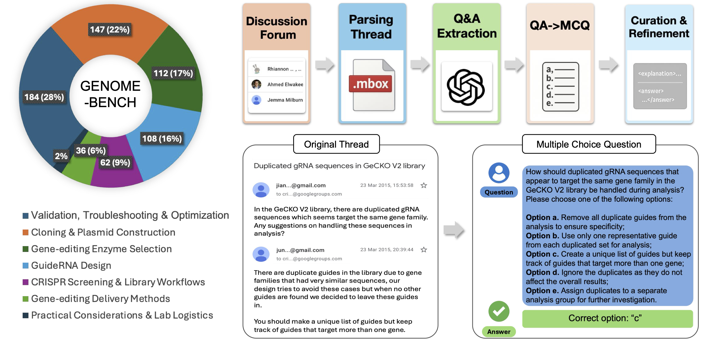
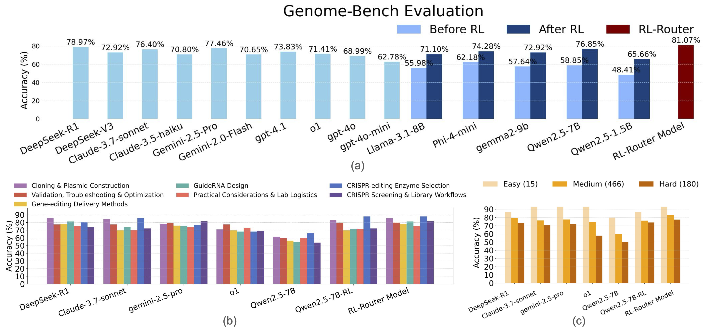

<div align="center">

# Genome-Bench: Multi-Step Reasoning Evaluation and Training for Biomedical LLMs

<div>
🧬 A New Benchmark and RL Pipeline for Functional Genomics Reasoning 📊
</div>
</div>

<div>
<br>

<div align="center">

[[](https://arxiv.org/abs/your_arxiv_id)
[](https://github.com/your_org/Genome-Bench)
[](https://huggingface.co/datasets/your_org/Genome-Bench)

</div>
</div>

## Overview



We introduce **Genome-Bench**, a novel benchmark for evaluating and improving scientific reasoning in large language models. Genome-Bench consists of over 3,000 multiple-choice and QA items derived from CRISPR-related scientific discussions and forum threads, covering key topics in genome engineering, experimental design, and error analysis.

Our RL training pipeline (based on Group Relative Policy Optimization) improves model performance across expert-labeled evaluation sets. For example, our fine-tuned Qwen2.5-7B model exceeds GPT-4o in accuracy and consistency on multi-hop reasoning tasks.



---

## Getting Started 🎯

### Installation

```bash
git clone https://github.com/your_org/Genome-Bench.git
cd Genome-Bench
pip install -r requirements.txt
